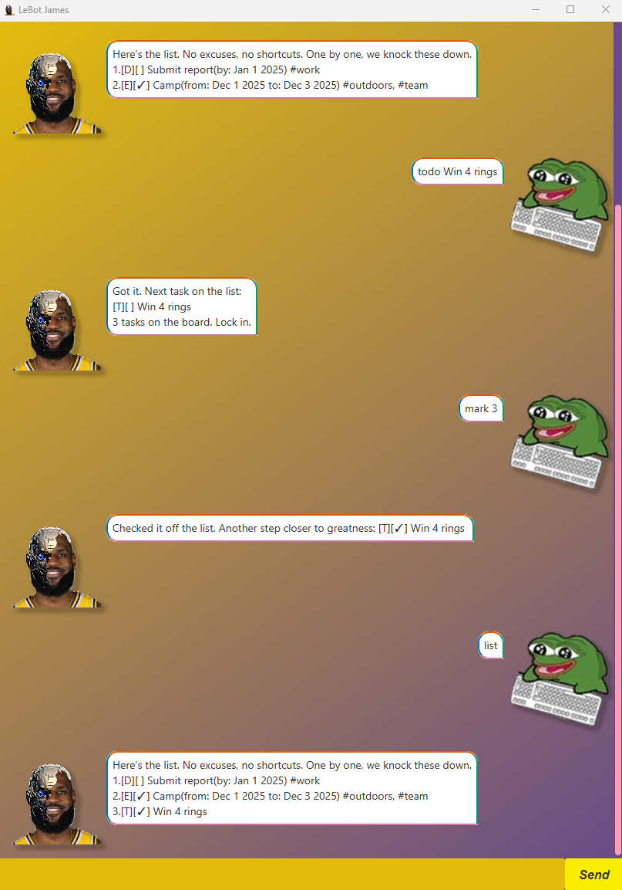

# LeBot User Guide

LeBot is a simple task manager that supports 3 main task types:

- Todo
- Deadline
- Event

LeBot also has other features such as task marking/unmarking, task deletion and task tagging.

## Quick Start
1. Ensure you gave Java 17 or above.
2. Download the latest `.jar` file.
3. Run the file using `java -jar LeBot.jar`.



# Features

## Adding ToDo Tasks

ToDo tasks are tasks without any specified timeframes. They can be added using the 'todo' keyword.

Command: `todo Win 4 Rings`

Output:
```
[T][] Win 4 Rings
```

## Adding Deadline Tasks

Deadline tasks are tasks with a singular date associated to them. They are added using the 'deadline' keyword, 
along with a specified deadline.

Supplied dates must be in the format `dd/MM/yyyy` and immediately follow a `/by` argument.

Command: `deadline Bootcamp /by 25/02/2025`

Output:
```
[D][] Bootcamp (by: 25 February 2025)
```

## Adding Event Tasks

Event tasks are tasks with a two dates associated to them. They are added using the 'event' keyword,
along with specified 'to' and 'from' dates.

Supplied dates must be in the format `dd/MM/yyyy` and immediately follow a `/to` and `/from` argument.

The arguments can be provided in any order. 

Command: `event NBA Playoffs /from 25/02/2025 /to 14/04/2025`

Output:
```
[E][] NBA Playoffs (from: 25 February 2025 to: 14 April 2025)
```

## View Current Tasks

Added tasks can be viewed using the `list` keyword.

Command: `list`
```
Here’s the list. No excuses, no shortcuts. One by one, we knock these down.
1.[T][ ] Win 4 Rings 
2.[D][ ] Bootcamp (by: Feb 25 2025) 
3.[E][ ] NBA Playoffs  (from: Feb 25 2025 to: Apr 14 2025) 
```

## Marking Tasks

Tasks can be marked as complete or incomplete using the `mark` and `unmark` keywords, followed by the Task index.

Command: `mark 1`

```
Checked it off the list. Another step closer to greatness: [T][✓] Win 4 Rings
```

Command: `unmark 1`

```
Alright, not done yet. Back in the lab, time to finish the job: [T][ ] Win 4 Rings
```

## Tagging Tasks

Tags can be assigned to tasks to further differentiate them. This is done using the `tag` keyword, followed by the index
of the task, and the desired tag name.

Each task can have multiple tags.

Command: `tag 1 GOAT`

```
Alright, tagged the task: [T][ ] Win 4 Rings #GOAT
```

Command: `tag 1 Blessed`

```
Alright, tagged the task: [T][ ] Win 4 Rings #GOAT, #Blessed
```